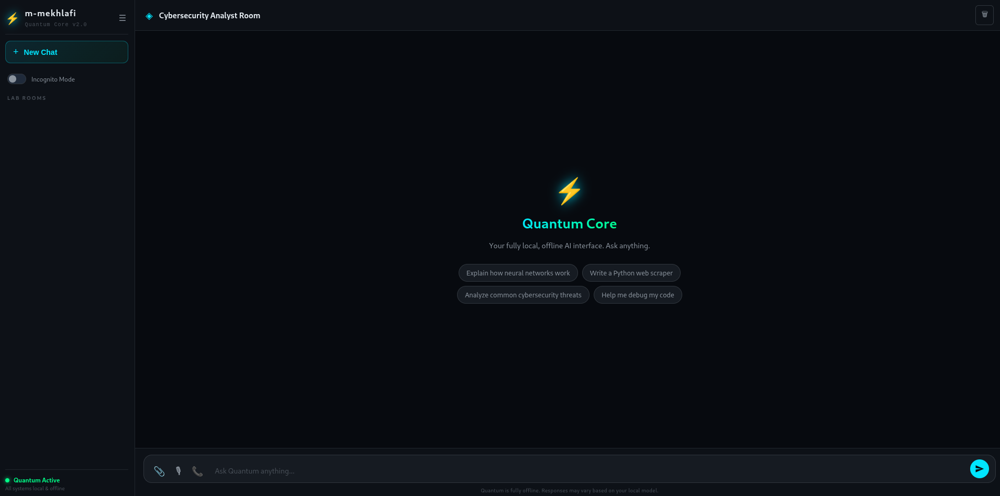

# 🌌 Quantum Core
<div align="center">

An advanced, privacy-first Local AI Assistant powered by cutting-edge Open Source technologies. Quantum Core integrates speech-to-text, local large language models (LLMs), and high-quality voice synthesis into a responsive, seamless web interface.

---

## 🚀 Features

- **100% Local & Private:** No data leaves your machine. Full data sovereignty.
- **Voice Interaction:** High-accuracy speech recognition powered by **Whisper**.
- **Natural Speech Synthesis:** Realistic, studio-quality audio generation using **Kokoro TTS (ONNX)**.
- **Intelligent Orchestration:** Powered locally via **Ollama** for smart and contextual responses.
- **Interactive Web Interface:** A sleek, user-friendly frontend with intuitive controls, including real-time audio playback and a **Stop Voice** safety trigger.

---

## 🛠️ Tech Stack

- **Backend:** Python, Flask
- **AI/ML Inference:** ONNX Runtime, WhisperModel, Ollama API
- **Frontend:** HTML5, CSS3, Modern JavaScript
- **Version Control:** Git & GitHub (Optimized repository excluding heavy weights)

---

## 📂 Project Structure

```text
Quantum Core/
├── website/                 # Frontend assets (HTML, CSS, JS, UI components)
├── model/                   # Local AI Model storage (Excluded from VCS)
│   └── whisper_model/       # Whisper model weights
├── server.py                # Main Flask backend orchestration script
├── .gitignore               # Strict security and file tracking filters
└── README.md                # Project documentation
📦 Installation & Setup
1. Prerequisites
Ensure you have Python 3.10+ and Ollama installed locally.

2. Clone the Repository
Bash
git clone [https://github.com/m-mekhlafi/Quantum-Core-.git](https://github.com/m-mekhlafi/Quantum-Core-.git)
cd Quantum-Core-
3. Environment Setup
Create a virtual environment and install the required dependencies:

Bash
python3 -m venv venv
source venv/bin/activate  # On Windows use: venv\Scripts\activate
pip install -r requirements.txt
4. Local Model Placement
Place your downloaded weights into the root directory (Note: These are ignored by Git to keep the repository lightweight):

kokoro-v1.0.onnx

voices-v1.0.bin

5. Running the Application
Ensure your Ollama service is running locally, then spin up the Flask backend:

Bash
python server.py
Open your browser and navigate to http://127.0.0.1:5000 to interact with Quantum.

🛡️ License
This project is licensed under the Apache 2.0 License.
